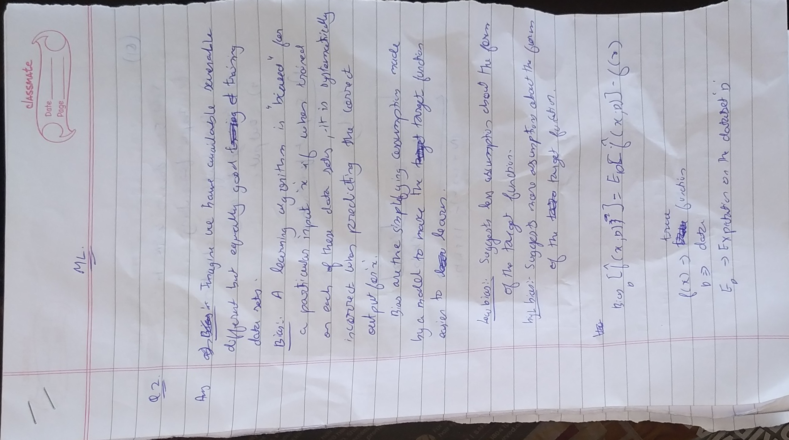
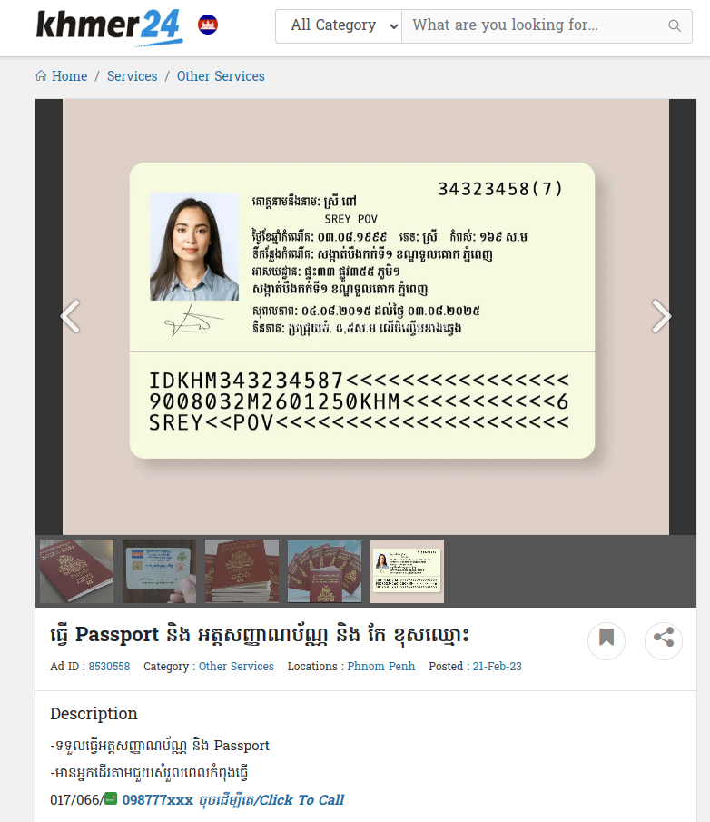
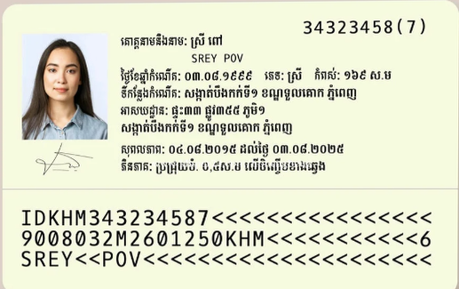

# Autocrop_kh

#### Automatic Document Segmentation and Cropping for Khmer IDs, Passport and Documents

Autocrop_kh is a Python package for automatic document segmentation and cropping, with a focus on Khmer IDs, Passport and other documents. It uses a DeepLabV3 model training on Khmer ID, Passport document datasets to accurately segment and extract documents from images.

License: [Apache-2.0 License](https://github.com/MetythornPenn/sdab/blob/main/LICENSE)

## Installation

#### Install from source

```sh

# clone repo 
git clone https://github.com/MetythornPenn/autocrop_kh.git

# install lib from source
pip install -e .

```

#### Install from PyPI
```sh
pip install autocrop-kh
```

## Usage

#### Python Script

```python
import cv2
from autocrop_kh import autocrop

# Download sample image from this url : "https://github.com/MetythornPenn/autocrop_kh/raw/main/sample/img-1.jpg"
# Download model from this url: "https://github.com/MetythornPenn/autocrop_kh/raw/main/models/autocrop_model_v2.onnx"

extracted_document = autocrop(
    img_path=img_path,
    model_path=model_path, 
    device='cuda:0'
)

output_path = "extracted_document.jpg"
cv2.imwrite(output_path, extracted_document[:, :, ::-1])  # Convert back to BGR for saving
print(f"Extracted document saved to {output_path}")

```

- `img_path`: Path of the input image file.
- `model_path`: Path to the pre-trained model (local path and support both .onnx and .pth).
- `device`: Specify `cpu` or `cuda` or `mps` (default is `gpu`).
- `output_path`: Path where the extracted document image will be saved.

#### Result:

<p align="center">
  
  
</p>

<p align="center">
  
  
</p>


#### Running as API & Web
```sh
# clone repo
git clone https://github.com/MetythornPenn/autocrop_kh.git

# go to directory
cd autocrop

# install libraries
pip3 install -r requirements.txt

# start server (http://localhost:5555/docs)
make server

# start client ((http://localhost:7860))
make client 

```
**Noted** : This model was trained with 25000 datasets include opensource data and my custom synthetic data.
## Reference 
- Inspired by [DeepLabV3](https://paperswithcode.com/method/deeplabv3)
- [Publish python package to PyPI](https://www.youtube.com/watch?v=90PWQEc--6k)
